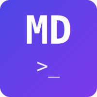

# Markdown Code Runner

**Automatically execute code blocks within Markdown files and update the output in-place**

<div style="text-align: center; margin: 2rem 0;">
  
</div>

<!-- CODE:START -->
<!-- from docs_gen import readme_section -->
<!-- print(readme_section("intro")) -->
<!-- CODE:END -->
<!-- OUTPUT:START -->
<!-- PLACEHOLDER --> Output is generated during CI build. We don't commit generated content to keep docs copyable and avoid recursion. See docs/docs_gen.py
<!-- OUTPUT:END -->

<div style="text-align: center; margin: 2rem 0;">
  <a href="https://pypi.org/project/markdown-code-runner/" class="md-button md-button--primary">
    Install from PyPI
  </a>
  <a href="https://github.com/basnijholt/markdown-code-runner" class="md-button">
    View on GitHub
  </a>
</div>

## Features

<!-- CODE:START -->
<!-- from docs_gen import readme_section -->
<!-- print(readme_section("features")) -->
<!-- CODE:END -->
<!-- OUTPUT:START -->
<!-- PLACEHOLDER --> Output is generated during CI build. We don't commit generated content to keep docs copyable and avoid recursion. See docs/docs_gen.py
<!-- OUTPUT:END -->

## Why Use Markdown Code Runner?

<!-- CODE:START -->
<!-- from docs_gen import readme_section -->
<!-- print(readme_section("problem-statement")) -->
<!-- CODE:END -->
<!-- OUTPUT:START -->
<!-- PLACEHOLDER --> Output is generated during CI build. We don't commit generated content to keep docs copyable and avoid recursion. See docs/docs_gen.py
<!-- OUTPUT:END -->

## Quick Example

Here's how simple it is to use `markdown-code-runner`:

**Hidden Code Block:**

```markdown
<!​-- CODE:START -->
<!​-- print('Hello, world!') -->
<!​-- CODE:END -->
<!​-- OUTPUT:START -->
This will be replaced by the output.
<!​-- OUTPUT:END -->
```

**Visible Code Block:**

````markdown
```python markdown-code-runner
print('Hello, world!')
```
<!​-- OUTPUT:START -->
This will be replaced by the output.
<!​-- OUTPUT:END -->
````

After running `markdown-code-runner`:

```markdown
<!​-- OUTPUT:START -->
<!​-- ⚠️ This content is auto-generated by `markdown-code-runner`. -->
Hello, world!

<!​-- OUTPUT:END -->
```

[Get Started →](getting-started.md){ .md-button .md-button--primary }
[View Examples →](examples.md){ .md-button }

## License

<!-- CODE:START -->
<!-- from docs_gen import readme_section -->
<!-- print(readme_section("license")) -->
<!-- CODE:END -->
<!-- OUTPUT:START -->
<!-- PLACEHOLDER --> Output is generated during CI build. We don't commit generated content to keep docs copyable and avoid recursion. See docs/docs_gen.py
<!-- OUTPUT:END -->
